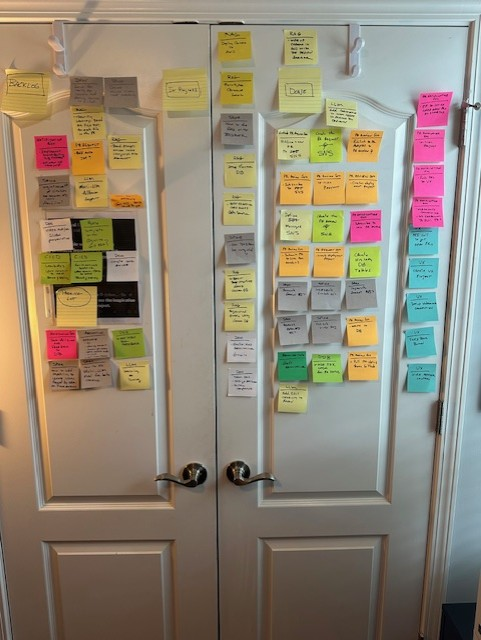

# pull-request-automated-review
The Automated Pull Request Reviewer Bot leverages Large Language Models (LLMs) to  automate the review of pull requests (PRs) . The purpose is to  enhance the efficiency and accuracy of code reviews by providing detailed feedback,  identifying potential issues, and suggesting improvements to streamline the code review process.

pr_request and pr_review are deployed as lambdas and are the core operative code.  
pr_chat is not used, it has been moved to pull-request-automated-chat.  
chroma_load is used to load style documents into chroma  
chroma_server creates a docket image of the chroma vector store which can be deployed to ECS.  

** See /CloudFormation for all CF templates for this project. **  
** See /docs/Deployments.docx for notes on build and deployments of all related components including CF for the infrastructure.**  

** Repos included as part of this project: **  
pull-request-automated-review: this one. Code review orchestration and github integration. Lamdas.  
pull-request-automated-chat: Chat conversation inteface. Python running in ECS.  
pull-request-automated-notifications. Push PR service. C# running in ECS.  
pull-request-automated-git-provider. Not implemented. REST API for git services. This functionality currently part of pull-request-automated-review.  
pull-request-automated-experiments: project for prototyping API interfaces.  
pull-request-test-repo: Early repo used to create PRs for testing.   

## System Design Sketch 

## AWS High Level Architecture

## Logical Design

## System Design Guide

## Final Scrum

